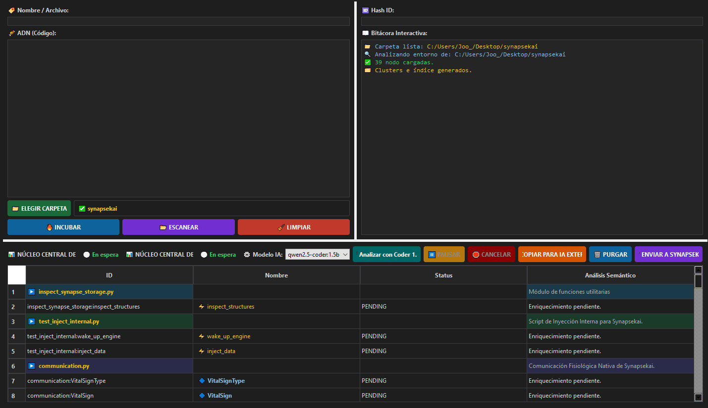
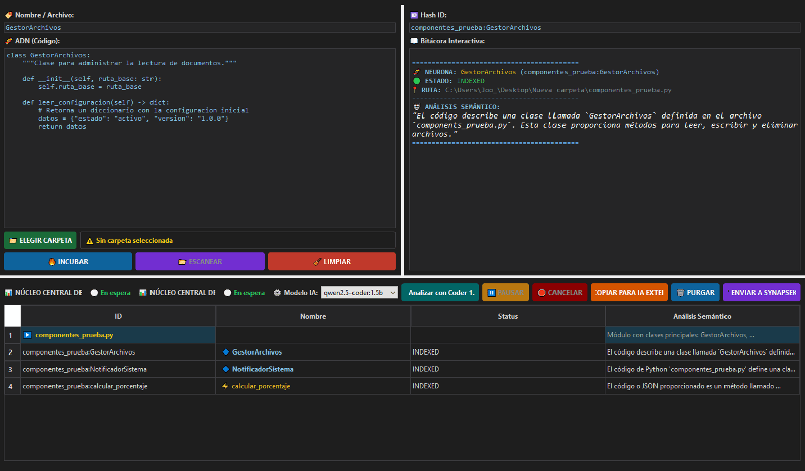

# 🧠 BioBrain Poliglota — Visión del proyecto

## Propósito

BioBrain es una herramienta de análisis estructural de software diseñada para facilitar la comprensión de proyectos complejos.

Transforma código fuente existente en una representación organizada de su arquitectura interna, permitiendo explorar sistemas de software sin modificar su código original.

Su objetivo es reducir el tiempo necesario para comprender bases de código existentes mediante la extracción y organización automática de información técnica relevante.

---

# 🌍 Qué hace

BioBrain analiza proyectos de software y genera un modelo estructural basado en sus componentes internos.

Actualmente permite identificar:

* lenguajes utilizados
* archivos del proyecto
* clases
* funciones
* métodos
* componentes relacionados
* estructura jerárquica del sistema

La información generada puede utilizarse para:

* documentación técnica
* análisis arquitectónico
* exploración de código existente
* soporte para herramientas de IA
* visualización de estructuras de software

---

# ⚙️ Cómo funciona

El sistema utiliza un flujo modular:

```text
Proyecto fuente
        |
        ↓
Detección de lenguaje
        |
        ↓
Router Poliglota
        |
        ↓
Motores de análisis
        |
        ↓
Modelo estructural
        |
        ↓
Contexto enriquecido
```

Los componentes principales incluyen:

* análisis AST para Python
* análisis Tree-sitter para Java
* detección automática de lenguaje
* extracción estructural de componentes
* indexación jerárquica del sistema
* generación de datos estructurados en JSON
* análisis asistido mediante IA local

---

# 🧱 Arquitectura interna

BioBrain está diseñado mediante una separación progresiva de responsabilidades:

* interfaz de usuario
* coordinación del flujo de análisis
* detección y selección de lenguaje
* motores de extracción estructural
* generación de contexto para IA
* almacenamiento de información generada

Esta separación permite mejorar y extender cada componente sin afectar el funcionamiento global del sistema.

El objetivo arquitectónico es mantener una base modular, mantenible y preparada para futuras extensiones.

---

# 🖥️ Interfaz del sistema

## 📂 Panel de escaneo



Este panel permite seleccionar un proyecto y ejecutar el análisis estructural del código fuente.

Muestra en tiempo real:

* detección del lenguaje
* progreso del análisis
* extracción de componentes
* generación del índice estructural

---

## 🧠 Panel de respuesta de IA local



Este panel muestra el resultado del análisis semántico realizado mediante IA local.

Cada componente del sistema puede ser enriquecido con:

* contexto técnico
* resumen funcional
* clasificación estructural
* información relevante para comprensión del código

---

# 🧬 Principios de diseño

BioBrain sigue los siguientes principios:

* análisis no invasivo
* procesamiento local
* separación de responsabilidades
* modularidad
* datos reutilizables
* evolución incremental

El sistema busca interpretar software antes que modificarlo.

---

# 📦 Capacidades actuales

Lenguajes soportados:

* Python
* Java

Procesamiento:

* análisis estructural del código fuente
* extracción de componentes internos
* representación jerárquica
* generación de modelos JSON
* análisis asistido por IA local
* exploración visual mediante interfaz gráfica

---

# 🚧 Estado actual

La versión actual se enfoca en consolidar una base estable mediante mejoras arquitectónicas:

* refactorización de componentes internos
* separación entre interfaz, extracción y procesamiento
* validación del flujo de análisis
* mejora de mantenibilidad
* fortalecimiento de la gestión de rutas y procesos internos

Estas mejoras permiten que BioBrain continúe evolucionando sobre una base más segura y modular.

---

# 🚀 Evolución futura

Las siguientes etapas contemplan ampliar la capacidad de comprensión del sistema mediante:

* análisis de documentación técnica
* visualización avanzada de arquitectura
* integración con nuevas herramientas externas
* soporte multimodal

Una posible evolución futura es incorporar una capa de percepción visual denominada **BioBrain Vision**, orientada a interpretar información complementaria como:

* diagramas arquitectónicos
* capturas de interfaces
* documentación visual
* representaciones gráficas del sistema

---

# 🧱 Qué no es BioBrain

BioBrain no es:

* un IDE
* un compilador
* un generador automático de código
* un agente autónomo que modifica sistemas

Es una herramienta de interpretación estructural del software.

---

# 🔌 Integración con otros sistemas

BioBrain puede exportar la estructura generada mediante datos estructurados en formato JSON.

Esta información puede ser utilizada por:

* herramientas de visualización
* sistemas externos de análisis
* asistentes de IA
* futuras capas de procesamiento

La filosofía de integración es:

> BioBrain interpreta y organiza el conocimiento del software; otros sistemas pueden consumir esa información.

---

# 🧭 Filosofía

BioBrain no reemplaza al desarrollador.

Su objetivo es reducir la distancia necesaria para comprender un sistema de software complejo.

Transforma una base de código difícil de explorar en una representación estructurada que facilita su análisis, documentación y evolución.

---

## 👤 Autor

Cristopher Joo — Chile
